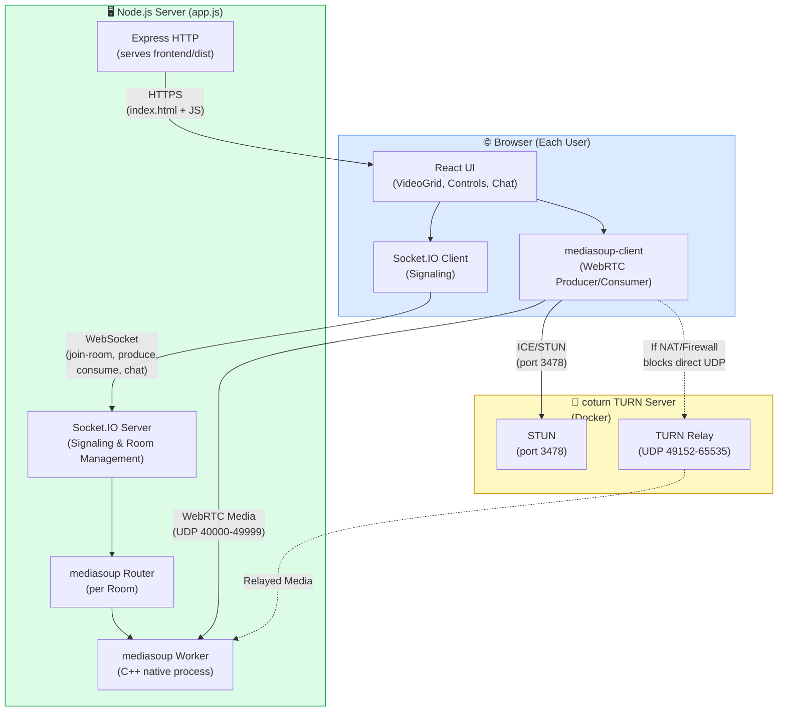
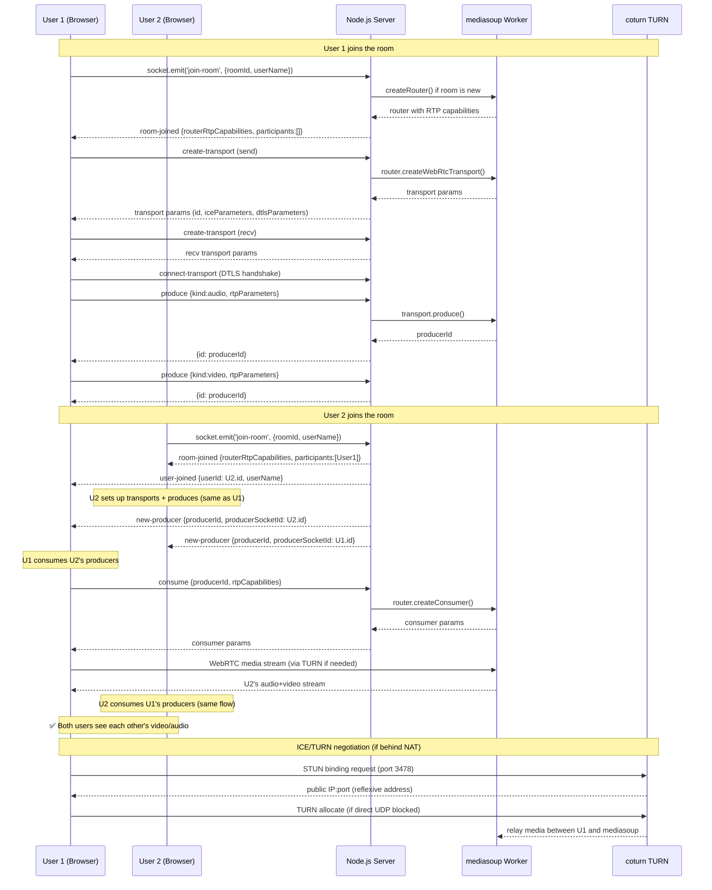
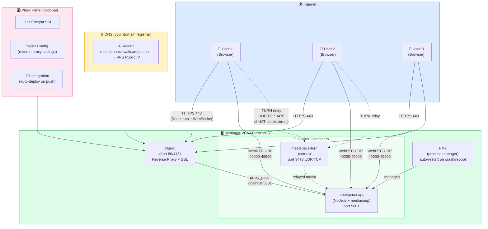
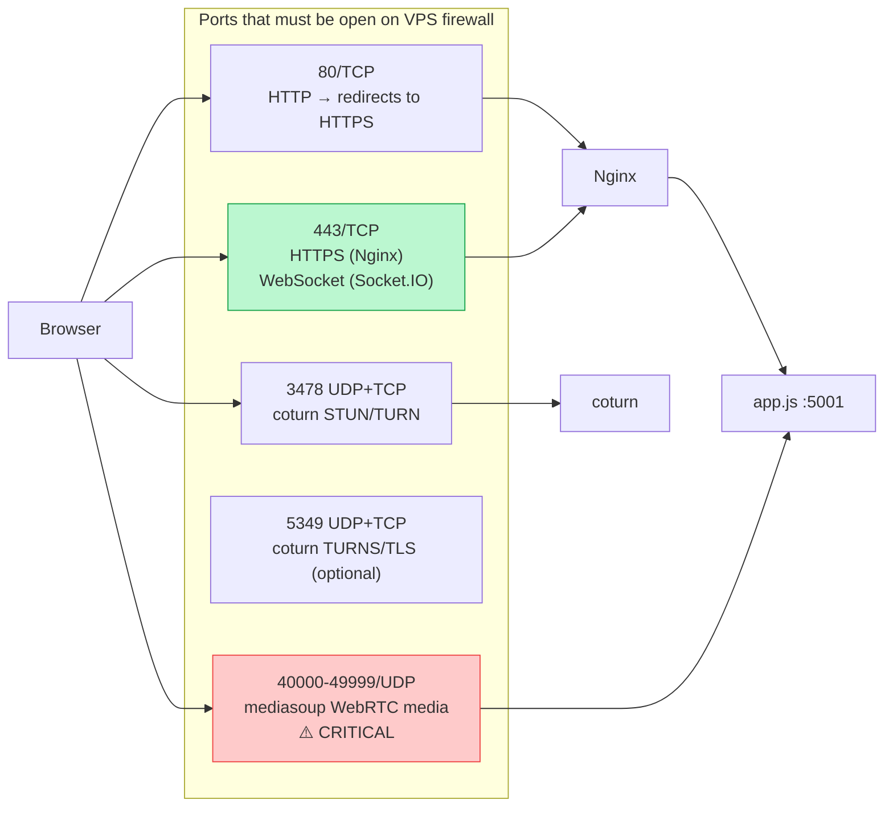

# MeetSpace — Architecture Diagrams

---

## Diagram 1 — How the System Works (Data Flow)

---

## Diagram 2 — Step-by-Step Join Flow (Sequence)

---

## Diagram 3 — Deployment Architecture

---

## Diagram 4 — Port Map

